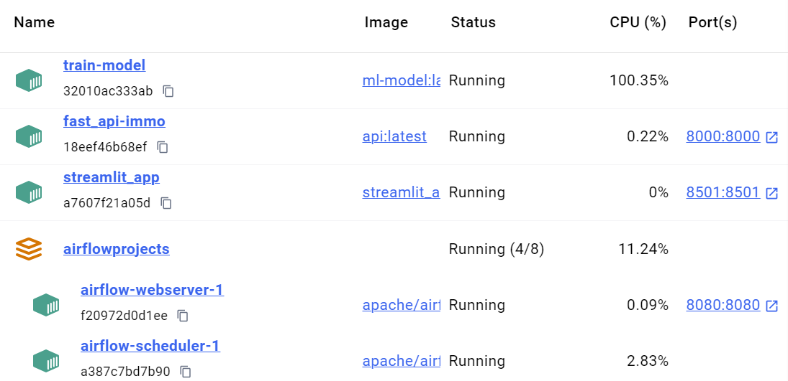
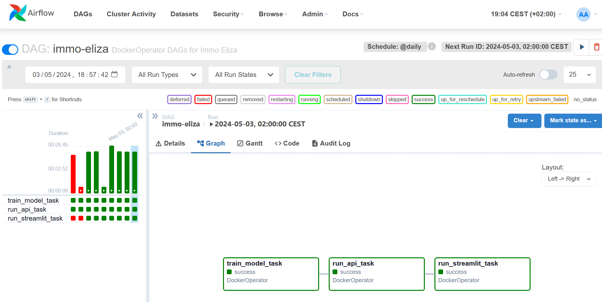

# Immo Eliza Airflow
[](https://img.shields.io/badge/Airflow-017CEE?style=for-the-badge&logo=Apache%20Airflow&logoColor=white)
[](https://img.shields.io/badge/Docker-2CA5E0?style=for-the-badge&logo=docker&logoColor=white)

## 📒 Description
This project puts together the work that has been done on previous projects at Becode:
- [Immoweb Scraper](https://github.com/gnadela/immo-eliza-scraping-Python_Pricers)
- [Real Estate Analysis](https://github.com/gnadela/immoeliza-analysis)
- [Machine Learning Modeling](https://github.com/gnadela/immo-eliza-ml)
- [API and Website for Property Price Prediction](https://github.com/gnadela/immo-eliza-deployment)

The goal is to use [Apache Airflow](https://airflow.apache.org/) to do this.

##  📦 Repo Structure 

```
├── airflow
│   ├── docker-compose.yaml
│   └── dags
│       └── immo_dag.py
├── ml
│   ├── Dockerfile
│   ├── train.py
│   └── requirements.txt
├── api
│   ├── Dockerfile
│   ├── app.py
│   ├── predict.py
│   └── requirements.txt
├── streamlit
│   ├── Dockerfile
│   ├── streamlit_app.py
│   └── requirements.txt
└── README.md
```

## 🛠 Pre-requisites
This project requires **Docker** and **Airflow** to be installed and running. The file */airflow/docker-compose.yaml* was used to install Airflow on local machine.

## 🪈 Pipeline
There are 3 parts of the pipeline featured here:
- Model training
- Running the API
- Running streamlit

The Repo structure reflects this: ml, api, streamlit.

## 🐋 Docker Everywhere

Docker containers were build for each part of the pipeline. Hence, separate Dockerfile and requirements.txt files are found in each of the pipeline directories.



## Airflow




## 🕐 Timeline

This project was created in 4 days.


